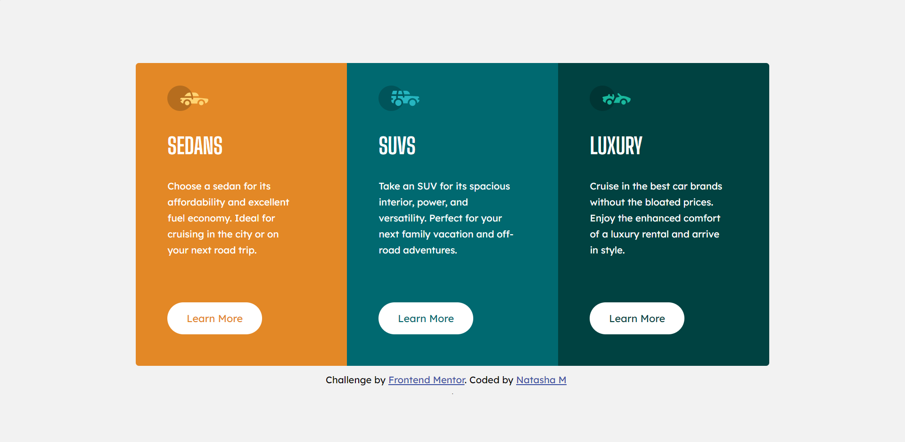

# Frontend Mentor - 3-column preview card component solution

This is a solution to the [3-column preview card component challenge on Frontend Mentor](https://www.frontendmentor.io/challenges/3column-preview-card-component-pH92eAR2-). Frontend Mentor challenges help you improve your coding skills by building realistic projects. 

## Table of contents

- [Overview](#overview)
  - [The challenge](#the-challenge)
  - [Screenshot](#screenshot)
  - [Links](#links)
- [My process](#my-process)
  - [Built with](#built-with)
  - [What I learned](#what-i-learned)
  - [Continued development](#continued-development)
  - [Useful resources](#useful-resources)
- [Author](#author)

## Overview

### The challenge
The challenge was to build out a 3-column preview card component and get it looking as close to the design as possible.

Users should be able to:

- View the optimal layout depending on their device's screen size
- See hover states for interactive elements

### Screenshot

### Links

- Solution URL: [https://www.frontendmentor.io/challenges/3column-preview-card-component-pH92eAR2-/hub/html-css-BgbxezdWI](https://your-solution-url.com)
- Live Site URL: [https://natasha-zw.github.io/3-column-preview-card-component-main/](https://your-live-site-url.com)

## My process

### Built with

- Semantic HTML5 markup
- CSS custom properties
- Flexbox

### What I learned

I learned how to use flexbox more effectively and the relationship between containers and their items. 

### Continued development

I'd like to focus on tranitions and animation next time. 
I'd also like to continue to get more  comfortable with flexbox.

## Author

- Website - [Natasha M](https://github.com/natasha-zw)
- Frontend Mentor - [@natasha-zw](https://www.frontendmentor.io/profile/natasha-zw)

